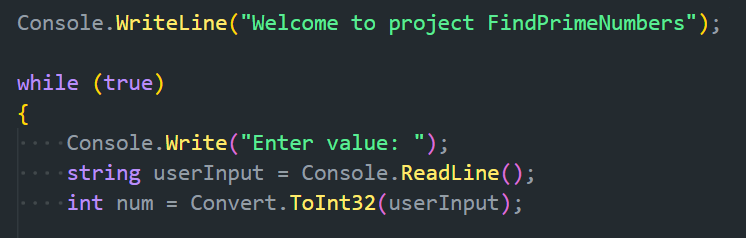
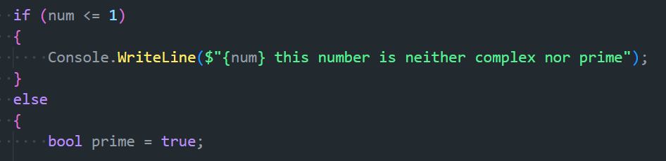
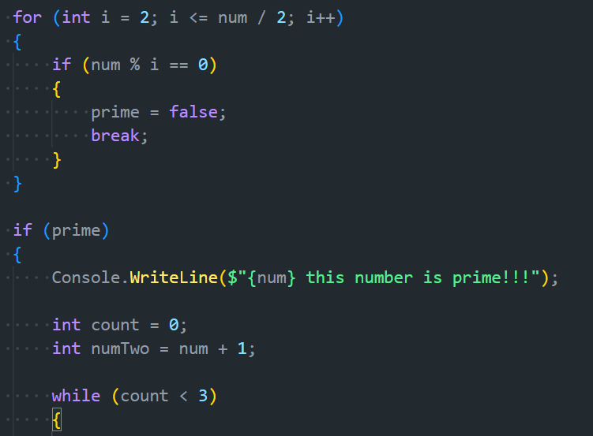

> **# Welcome to project FindPrimeNumbers**

### In this project, the user enters a value and the program determines whether the value entered by the user is a **Prime number** or a **non-Prime number**. If the value entered by the user is a **Prime number**, **the three** prime numbers following the entered value will be output to the console.

## Let's get acquainted with the sections of the project. 

1. Input and output section

2. If the number is 1 or less, the program outputs that the number is not prime. Otherwise, the program sets the boolean variable prime to true and checks the divisors of the number entered through the for loop.

3. If the number is divided by some value, the parent variable is changed to false and the loop is terminated. If the number is prime, the program uses a while loop to find the next three primes.

